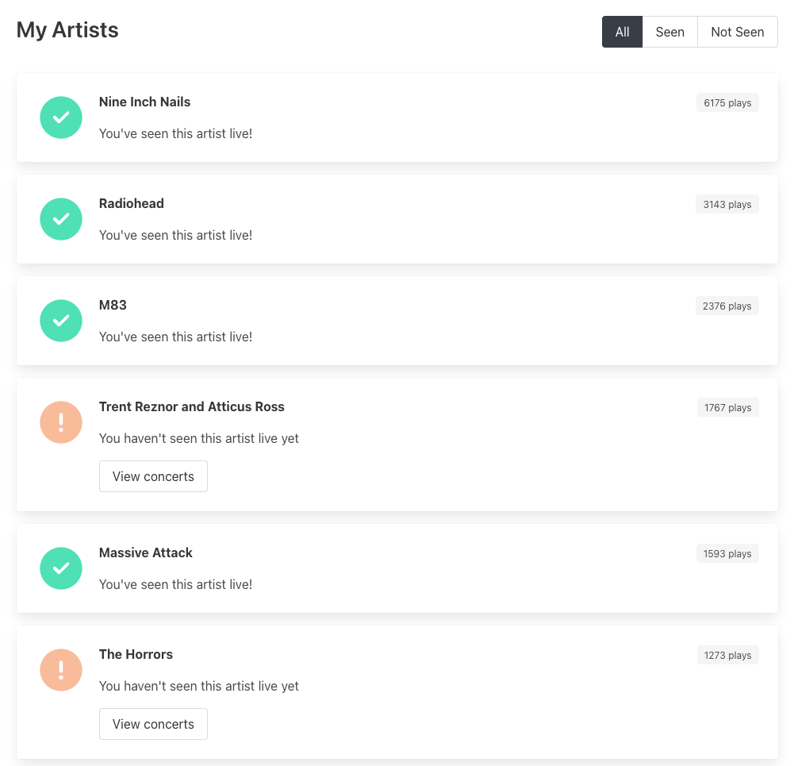

# 🎸 Concert Tracker

A website to show you which of your top artists you've not seen live.

Built with TypeScript, React and NextJS.



## Configuration

Make a copy of `.env.example`, name it `.env`, and fill in the following values:

```ini
SETLISTFM_API_KEY=  ; Your application's setlist.fm API key
SETLISTFM_USER_ID=  ; Your setlist.fm username

LASTFM_API_KEY=     ; Your Last.fm API key
LASTFM_API_SECRET=  ; Your Last.fm secret key
LASTFM_USER_ID=     ; Your Last.fm username
```

- [Create a setlist.fm API key](https://www.setlist.fm/settings/apps)
- [Create a Last.fm API key](https://www.last.fm/api/account/create)

## Installation

- `yarn`
  - `yarn dlx @yarnpkg/sdks vscode` (optional)
- `yarn db`

## Commands

| Command      | Description                    |
| ------------ | ------------------------------ |
| `yarn dev`   | Run development server         |
| `yarn build` | Compile website for production |
| `yarn start` | Run production server          |
| `yarn lint`  | Lint project                   |
| `yarn db`    | Reset database                 |
